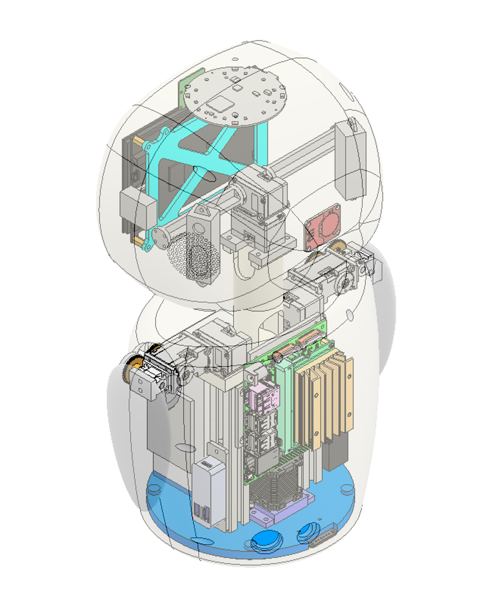
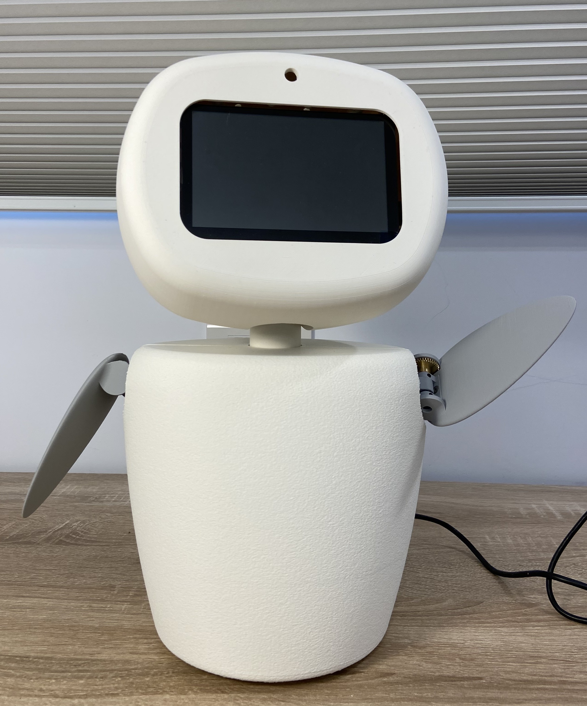

# Companion Robot

Undergraduate Research in the Robotics Lab @National Taiwan University

Advisor: Prof. Han-Pang Huang

## Abstract

Inspired by the social needs of people confined during the COVID-19 pandemic, this companion robot enhances physical interaction beyond verbal and visual communication by replicating the movements of remote users during video calls.

## System Introduction

### Hardware: mechanical

- **Degree-of-Freedom:** 7
    - Head: 2
    - Arms: 2, each
    - Base: 1
- **Actuator:**
    - Head & Arm: Dynamixel XL330-M288-T, in series
    - Base: XYZrobot A1-16
- **Material:** Aluminum (framework), Brass (spur gear), PLA (3D-printed parts)

### Hardware: electrical

- **Main Processor:** NVIDIA Jetson Nano Developer Kit 4GB
- **Displayer:** Waveshare 5-inch HDMI LCD (H)
- **Camera:** Pi-camera model 2
- **Battery:** Panasonic NCR18650B x 6 pics
- **Battery Management System:** BMS 3S (no brand)
- …, etc.

### Software

- **Operating System:** Ubuntu 18.04 LTS
- **Programming Language:** Python3, C++
- **ROS:** Melodic (with python3 package)
- **Key Packages:**
    - Mediapipe – machine learning pipeline
    - OpenCV – image processing
    - DynamixelSDK – head & arm motors control
    - A1_16 – base motor control

## File System

companion_robot/

- **config.py** - main configuration file
- **utils.py** - common function
- **dynamixel_config.py** - dynamixel API configuration file
- **dynamixel.py** - dynamixel API module
- **head_arm.py** - head, arm motor control
- Jetson_ws/
    - .../include//video_chat/**A1_16.h** - header file
    - …/src/
        - **A1_16.cpp** - A1-16 motor module
        - **base.cpp** - base motor control
- **laptop.py** - laptop main program
- **robot.py** - robot main program
